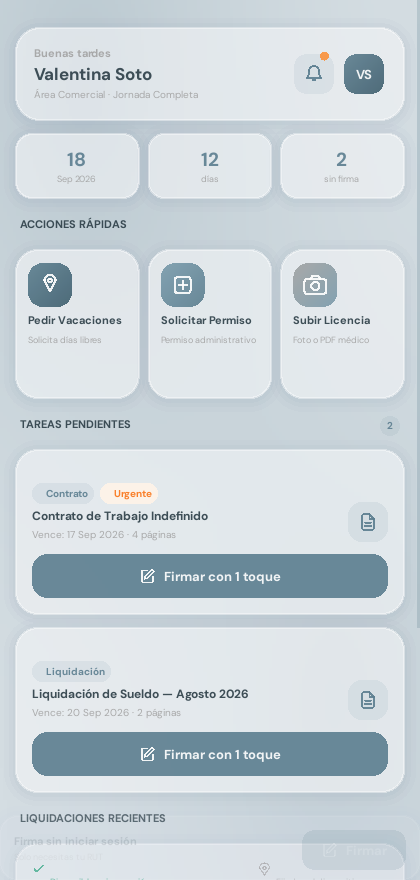
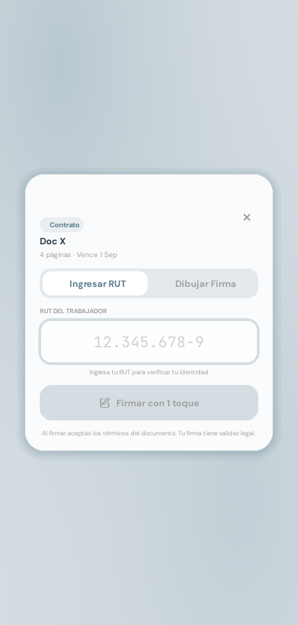
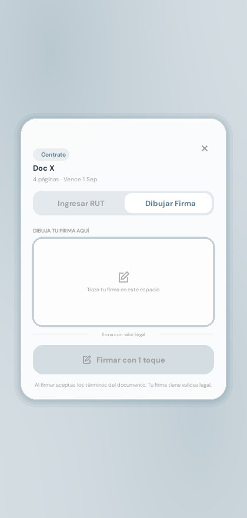
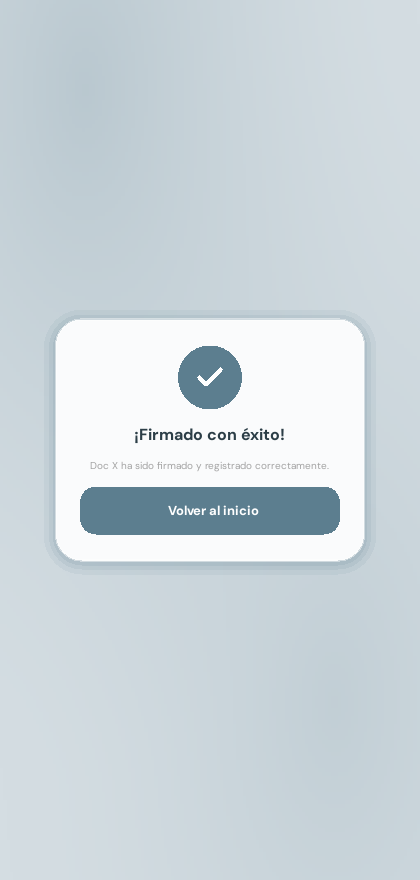

# FirmApp — Interfaz de Recursos Humanos (Kivy + KivyMD)

Maqueta funcional construida con **Kivy y KivyMD**, siguiendo la arquitectura
de la **Sesión 12 (KV Language y la separación de la lógica)**: la interfaz
visual vive completa en un archivo `.kv` y `main.py` solo contiene clases con
propiedades y métodos de evento.

## Problema que resuelve

En muchas empresas, firmar un documento de RR.HH. (contrato, liquidación de
sueldo, permiso) obliga al trabajador a imprimir, firmar a mano, escanear y
reenviar por correo — un proceso lento y que no todos pueden hacer desde el
celular. FirmApp propone firmar esos documentos desde el teléfono en un solo
flujo: ver los documentos pendientes, identificarse con el RUT o dibujar la
firma, y confirmar. Es una **maqueta** (no persiste datos, no valida contra
un servidor ni tiene validez legal real todavía): su objetivo es probar esa
experiencia de uso antes de construir el backend.

## Usuario objetivo

Trabajadores de una empresa (área comercial, operaciones, etc.) que reciben
documentos de RR.HH. para firmar de forma periódica (contratos, liquidaciones
de sueldo, permisos) y que hoy lo resuelven fuera de la app, muchas veces con
poca familiaridad con apps corporativas — de ahí que el flujo de firma se
haya reducido a dos pasos como máximo (RUT o dibujo) y textos cortos y
directos.

## Capturas de pantalla

| Inicio | Firmar — RUT | Firmar — Dibujo | Éxito |
|---|---|---|---|
|  |  |  |  |

## Fundamentación UX/UI

El diseño y la estructura de pantallas se basan en una encuesta de
diagnóstico real (11 respuestas) al socio comunitario y usuarios objetivo.
Metodología, hallazgos con evidencia y la matriz hallazgo → decisión de
diseño están en [`FUNDAMENTACION-UX-UI.md`](FUNDAMENTACION-UX-UI.md).

## Declaración de uso de IA

Se usó IA (Claude / Claude Code) para analizar el proyecto, corregir errores
y adaptar la estructura a los requisitos de la evaluación (navegación con
`ScreenManager`, orden del repositorio). El detalle completo — qué se pidió,
qué se cambió y por qué — está documentado en [`uso_ia.md`](uso_ia.md).

## 1. Estructura de archivos

```
FirmApp/
├── main.py                    <- SOLO clases y lógica (hereda de MDApp)
│                                  ScreenManager + 3 pantallas: Inicio, Firmar, Éxito
├── interfazrrhh.kv            <- TODO el diseño visual (componentes KivyMD)
├── widgets.py                 <- Clases base sobre MDBoxLayout / MDCard / MDTextField
├── icons.py                   <- Los iconos SVG del diseño, redibujados para Kivy
├── theme.py                   <- Colores y tipografías
├── requirements.txt
├── FUNDAMENTACION-UX-UI.md    <- Investigación de usuarios y matriz hallazgo → decisión
├── uso_ia.md                  <- Declaración de uso de IA (este proyecto)
└── assets/
    ├── fonts/                  <- DMSans_18pt-{Regular,Bold}.ttf, JetBrainsMono-Regular.ttf
    └── screenshots/             <- Capturas usadas en este README
```

## Navegación (ScreenManager)

La maqueta original no tenía `ScreenManager`: era una sola pantalla con un
modal superpuesto. Se reestructuró a 3 pantallas navegables, tal como exige
la evaluación:

1. **`home`** (`HomeScreen`) — tablero: saludo, estadísticas, acciones
   rápidas, tareas pendientes y liquidaciones recientes.
2. **`sign`** (`SignScreen`) — tarjeta de firma con dos pestañas (RUT /
   Dibujar) para el documento elegido en Inicio.
3. **`success`** (`SuccessScreen`) — confirmación de firma, con botón para
   volver a Inicio.

`InterfazRRHHApp.build()` crea las 3 pantallas una sola vez dentro de un
`ScreenManager` y la navegación (`go_to_sign`, `go_to_success`, `go_home`)
solo cambia `sm.current` con una transición (`SlideTransition`) — no crea ni
destruye widgets en cada viaje, a diferencia del modal original.

## 2. Instalación en Visual Studio Code

1. Instala **Python 3.10 u 11** (en Windows marca *Add Python to PATH*).
   KivyMD 1.2.0 no es compatible con Python 3.13.
2. VS Code → `Archivo > Abrir carpeta…` → la carpeta del proyecto.
3. Instala la extensión **Python** de Microsoft.
4. Terminal integrada (`Ctrl+Ñ` o `Ctrl+~`) y crea el entorno:
   - Windows: `python -m venv .venv` → `.\.venv\Scripts\Activate.ps1`
   - macOS/Linux: `python3 -m venv .venv` → `source .venv/bin/activate`
5. `Ctrl+Shift+P` → *Python: Select Interpreter* → elige el `.venv`.
6. Instala las dependencias:
   ```bash
   pip install -r requirements.txt
   ```
   (instala `kivy>=2.3.0` y `kivymd==1.2.0`)
7. Ejecuta:
   ```bash
   python main.py
   ```

> La primera ejecución puede tardar 15–30 s en abrir la ventana mientras Kivy
> inicializa OpenGL. No presiones `Ctrl+C`: eso aborta la carga y produce un
> `KeyboardInterrupt` dentro de `kivy.core.gl`.

## 3. Componentes de KivyMD utilizados

| Componente KivyMD | Dónde se usa |
|---|---|
| `MDApp` | `InterfazRRHHApp`, con `theme_cls` configurado a la paleta del diseño |
| `MDBoxLayout` | Base de `GlassCard`, `Pill`, `DocRow`, `SectionLabel` y de todos los contenedores del `.kv` |
| `MDFloatLayout` | Base de `MeshBackground`, `GradientTile`, `IconTile`, `IconButton` |
| `MDGridLayout` | Rejillas de estadísticas y de Acciones Rápidas |
| `MDAnchorLayout` | Centrado dentro del lienzo de firma y de la pantalla de éxito |
| `MDScrollView` | Scroll de la pantalla principal |
| `MDLabel` | Todo el texto, mediante las clases dinámicas `Txt` y `TxtFijo` |
| `MDCard` | Base de `SolidButton` (superficie Material con `md_bg_color`, `radius`, `elevation`) |
| `MDTextField` | Base de `RutInput`, el campo del RUT |
| `MDWidget` | Base de `Icon`, `Dot`, `Divider` y de los espaciadores |

> `ScreenManager` / `Screen` (`kivy.uix.screenmanager`) no son de KivyMD sino
> de Kivy base; se usan para la navegación entre `HomeScreen`, `SignScreen` y
> `SuccessScreen` (ver sección "Navegación").

Las superficies se pintan con las propiedades nativas de KivyMD
`md_bg_color`, `radius`, `line_color` y `line_width` — heredadas de
`BackgroundColorBehavior`.

## 4. Correspondencia con la Sesión 12

| Diapositiva | Dónde está en este proyecto |
|---|---|
| **Separación de responsabilidades** | `interfazrrhh.kv` = diseño puro. `main.py` = clases + eventos, cero widgets armados a mano. |
| **Magia pura: la carga automática** | La app se llama `InterfazRRHHApp` → Kivy busca solo `interfazrrhh.kv`. No hay `Builder.load_file()`. |
| **Anatomía de un archivo .kv** | Cada componente tiene su regla `<NombreClase>:` con indentación de 4 espacios. |
| **Integrando componentes de KivyMD** | Ver la tabla de la sección 3. Igual que `<FormularioAS@MDBoxLayout>` del ejemplo. |
| **El motor lógico en Python** | `class InterfazRRHHApp(MDApp)` con `def build(self)`, igual que `FormularioApp(MDApp)`. |
| **IDs: el puente de la vista a la lógica** | `SignPanel` usa `self.ids.rut_input`, `self.ids.cta`, `self.ids.tab_rut`… |
| **Eventos: respondiendo con `root`** | `on_release: root.sign_pressed()`, `on_release: root.set_tab('rut')`, `on_release: root.sign()`. |
| **Refactorización: de spaghetti a arquitectura** | No queda ningún `add_widget()` encadenado para construir la interfaz. |

## 5. La única lógica que sigue en Python (y por qué)

Siguiendo el propio taller ("Interconexión: imprimir en la terminal los datos
leídos a través de `ids`"), **los datos no son diseño**. Por eso `main.py`
recorre dos listas (`PENDING`, `RECENT`) y llama
`self.ids.pending_box.add_widget(PendingCard(**doc))` — no arma la tarjeta,
solo la alimenta con datos. Todo el resto vive en `interfazrrhh.kv`.

## 6. Qué se puede hacer en pantalla

- Animación de entrada escalonada de las tarjetas.
- Pulsado (escala 0.96) y hover (escala 1.02) en tarjetas y botones.
- Navegar a la pantalla **Firmar** desde "Firmar con 1 toque" o desde la barra inferior.
- Pestaña **Ingresar RUT**: formato automático `12.345.678-9` y validación visual.
- Pestaña **Dibujar Firma**: lienzo táctil y botón Limpiar.
- Pantalla **¡Firmado con éxito!**.

Interruptores al inicio de `main.py`:

```python
SHOW_DESKTOP_CTA = False  # True -> agrega la tarjeta "¿No iniciaste sesión?"
ENTRY_ANIMATION = True    # animación de entrada al abrir la app
```

## 7. Ajustes necesarios para que Material no altere el diseño

KivyMD aplica su propio tema por encima de lo que uno declara. Estos cuatro
puntos fueron necesarios para conservar el diseño de Figma:

1. **`theme_text_color: 'Custom'`** en `Txt` y `TxtFijo`. Sin esto `MDLabel`
   pinta el texto con el color del tema Material e ignora `text_color`.
2. **`disabled_color: self.text_color`** en esas mismas clases. Un `MDLabel`
   dentro de un widget deshabilitado se pinta con `disabled_color` del tema;
   sin esta línea el texto del botón "Firmar con 1 toque" deshabilitado no
   quedaba en `#A2A2A2` como pide el diseño.
3. **`adaptive_width: True`** en las etiquetas que deben medir lo que mide su
   texto. `MDLabel` fija `text_size` al ancho del widget, lo que rompe el
   ajuste manual con `width: self.texture_size[0]`.
4. **`RutInput.set_default_colors()` sobrescrito** en `widgets.py`. KivyMD
   considera que un color `[0, 0, 0, 0]` está "sin definir" y lo reemplaza
   por uno del tema, así que era imposible dejar transparentes el subrayado
   y el relleno del `MDTextField` desde el `.kv`. También se sobrescribe
   `set_text()` porque la versión de Material valida el campo y anima el
   hint flotante, lo que entra en recursión al reformatear el RUT.

## 8. Qué no se pudo tomar de Material (y por qué)

- **`MDRaisedButton`**: impone su propia sombra, su *ripple* y su tipografía
  en mayúsculas. Los botones usan `MDCard` + comportamiento de pulsado, que
  da la misma superficie Material sin alterar el diseño.
- **`MDIcon`**: pinta iconos de una fuente tipográfica (Material Icons). El
  diseño de Figma trae iconos vectoriales propios, dibujados en `icons.py`.
- **`MDSeparator`**: usa el color de divisor del tema. `Divider` dibuja la
  línea a mano para conservar el `#D4DDE2` al 85 % del prototipo.
- **`backdrop-filter: blur()`** del CSS original no existe en Kivy: el efecto
  vidrio se imita con blanco semitransparente + borde claro + sombra en capas
  (`GlassCard` en `widgets.py`).

## 9. Notas técnicas (si sigues editando el `.kv`)

- **`MDFloatLayout` solo mueve los ejes que le indiques**: si un hijo usa
  `pos_hint: {'center_y': .5}` sin `'x'`/`'center_x'`, Kivy deja su `x` en 0.
  Por eso aquí siempre se fijan ambos ejes.
- **`MDBoxLayout` ignora `pos_hint`** en sus hijos; donde hacía falta centrar
  algo dentro de un `MDBoxLayout` se usó `MDAnchorLayout`.
- El `radius` de KivyMD es una lista de 4 valores. `GlassCard` lee
  `self.radius[0]` para calcular la sombra.
- `GradientTile` usa `tile_radius` en vez de `radius` para no chocar con la
  propiedad nativa de KivyMD.
